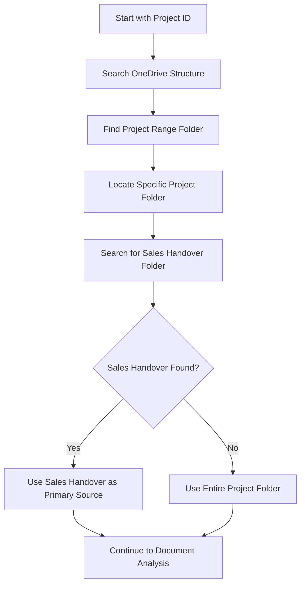
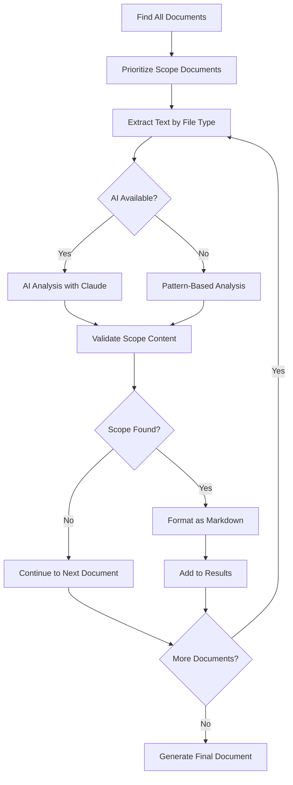

# Scope Generator Documentation

## Overview

The **Scope Generator** (`analysis/scope_generator.py`) is an intelligent document processing tool designed to automatically extract, analyze, and format Scope of Work (SOW) content from project documentation. It combines AI-powered analysis with robust pattern-based fallback processing to create professionally formatted markdown documents from various source file types.

## Key Features

### 🤖 **Hybrid Analysis Engine**
- **AI-Powered Analysis**: Uses OpenRouter API with Claude Haiku for intelligent content extraction
- **Pattern-Based Fallback**: Robust regex-based analysis when AI is unavailable
- **Smart Document Detection**: Prioritizes scope-related documents by filename and content

### 📄 **Multi-Format Document Support**
- **RTF Files**: Enhanced parsing with `striprtf` library and advanced fallback processing
- **Word Documents**: DOCX/DOC support via `python-docx` library
- **PDF Files**: Multiple extraction methods (PyPDF2, pdfplumber) with OCR indicators
- **Text Files**: Direct UTF-8 processing with encoding fallback

### 🗂️ **Intelligent Project Discovery**
- **Project Folder Detection**: Automatically locates project directories using embedded logic from `find_project_path.py`
- **Sales Handover Prioritization**: Focuses on "1. Sales Handover" folders as primary scope sources
- **Document Prioritization**: Processes scope-named documents first, then other relevant files

### 📝 **Advanced Markdown Formatting**
- **Hierarchical Headers**: Automatic detection and formatting of section headers
- **Smart List Creation**: Converts action items and bullet points to proper markdown lists
- **Professional Structure**: Creates well-organized, readable documentation

## How It Works

### 1. **Project Discovery Process**



The project discovery uses the same logic as `find_project_path.py`:
- Searches OneDrive folder structure
- Identifies project range folders (e.g., "21600-21699")
- Locates specific project directories
- Prioritizes "1. Sales Handover" folders for scope content

### 2. **Document Processing Pipeline**



### 3. **Text Extraction Methods**

#### **RTF File Processing**
The RTF parsing has been significantly enhanced:

1. **Primary Method**: Uses `striprtf` library for clean text extraction
2. **Fallback Processing**: Advanced regex-based RTF control sequence removal
3. **Multi-Encoding Support**: Tries UTF-8, CP1252, Latin1, ISO-8859-1
4. **Smart Cleanup**: Removes font tables, style sheets, and control words
5. **Quality Validation**: Checks extraction quality and retries with different methods

#### **Word Document Processing**
- Uses `python-docx` library for DOCX files
- Extracts paragraph text while preserving structure
- Handles formatting and embedded objects gracefully

#### **PDF Processing**
- **PyPDF2**: Primary text extraction method
- **pdfplumber**: Fallback for complex PDFs
- **OCR Detection**: Identifies when PDFs may require OCR processing

### 4. **Scope Content Analysis**

#### **AI-Powered Analysis (When Available)**
```python
# The AI prompt structure:
prompt = f"""Analyze this document for Scope of Work content. 
This is from an AV (Audio Visual) project document.

Document: {filename}
Content: {text}

Tasks:
1. Determine if this contains actual Scope of Work information
2. Extract and format it cleanly
3. Focus on: project objectives, deliverables, requirements, 
   systems to be installed, work to be performed

Respond in format:
CONTAINS_SCOPE: [YES/NO]
EXTRACTED_SCOPE: [cleaned content]
REASON: [explanation]"""
```

#### **Pattern-Based Analysis (Fallback)**
Searches for AV-specific patterns:
- `scope of work`, `project scope`, `deliverables`
- `audio visual`, `conference room`, `video conferencing`
- `supply and install`, `commissioning`, `training`
- Action words: `arrange`, `provide`, `install`, `mount`

### 5. **Markdown Formatting Engine**

The formatting system includes:

#### **Header Detection**
- **Main Sections** (### headers): Project Objective, Equipment and Materials, etc.
- **Sub-sections** (#### headers): Location names, equipment types, process phases

#### **List Formatting**
- **Action Items**: Automatically converts lines starting with action verbs to bullet points
- **Existing Lists**: Cleans up bullet points and numbered lists
- **Smart Detection**: Identifies list items by context and structure

#### **Structure Enhancement**
- Removes page numbers and artifacts
- Consolidates excessive whitespace
- Adds proper spacing between sections
- Preserves important formatting while cleaning up noise

## Usage

### **Basic Usage**
```bash
# Run with project ID
python analysis/scope_generator.py 21620

# Output will be saved as: 21620_project_scope.md
```

### **With AI Enhancement**
```bash
# Set OpenRouter API key for AI analysis
export OPENROUTER_API_KEY='your_api_key_here'
python analysis/scope_generator.py 21620
```

### **Custom Output**
```python
from analysis.scope_generator import AIScopeExtractor

# Initialize with AI
extractor = AIScopeExtractor(openrouter_api_key="your_key")

# Extract scope
success = extractor.extract_scope("21620", "custom_output.md")
```

## Configuration

### **Environment Variables**
- `OPENROUTER_API_KEY`: Optional API key for AI-powered analysis

### **Processing Limits**
- **Sales Handover Folders**: 25 documents maximum
- **Other Folders**: 10 documents maximum
- **AI Timeout**: 45 seconds per request

### **File Type Support**
- `.rtf` - Rich Text Format (enhanced parsing)
- `.docx`, `.doc` - Microsoft Word documents
- `.pdf` - Portable Document Format
- `.txt` - Plain text files

## Dependencies

### **Required Libraries**
```python
import os
import re
import sys
import glob
import requests
from typing import Optional, List, Dict, Any, Tuple
from datetime import datetime
```

### **Optional Libraries** (Auto-detected)
```python
# For enhanced RTF parsing
from striprtf.striprtf import rtf_to_text

# For Word document processing
import docx

# For PDF processing
import PyPDF2
import pdfplumber
```

## Output Format

### **Generated Markdown Structure**
```markdown
# Scope of Work - [PROJECT_ID]
**Project:** [Project Name]
*Generated: [Timestamp]*

## Overview
[Document summary and source count]

## Scope of Work
### [Section Headers]
#### [Sub-sections]
- [Formatted lists]
[Clean content]

## Source Documents
- **[Document Name]**
  - Path: `[Relative Path]`
  - Analysis: [Extraction method and patterns found]
```

### **Example Output Features**
- ✅ **Professional Headers**: Clear section hierarchy
- ✅ **Formatted Lists**: Action items as bullet points
- ✅ **Clean Content**: No RTF artifacts or formatting codes
- ✅ **Source Tracking**: Documents source files and analysis methods
- ✅ **Timestamp**: Generation date and time

## Error Handling

### **Graceful Degradation**
- Falls back from AI to pattern-based analysis
- Tries multiple encoding methods for RTF files
- Continues processing if individual documents fail
- Provides clear error messages and suggestions

### **Common Issues & Solutions**

#### **"No project folder found"**
- Ensure project ID exists in OneDrive structure
- Check if project is in correct range folder
- Verify OneDrive path accessibility

#### **"No scope content found"**
- Project may not have scope documents in Sales Handover
- Try searching entire project folder
- Check if files are in supported formats

#### **RTF parsing issues**
- Install `striprtf`: `pip install striprtf`
- Files may need manual conversion if heavily corrupted

#### **PDF text extraction failed**
- Install PDF libraries: `pip install PyPDF2 pdfplumber`
- PDFs may require OCR for scanned documents

## Technical Implementation

### **Class Structure**
```python
class AIScopeExtractor:
    def __init__(self, openrouter_api_key: Optional[str] = None)
    def find_project_folder(self, project_id: str) -> Optional[str]
    def extract_text_from_file(self, file_path: str) -> str
    def analyze_document_for_scope(self, file_path: str, text: str) -> Tuple[bool, str, str]
    def clean_scope_text(self, text: str) -> str
    def generate_scope_markdown(self, project_id: str, project_folder: str, scope_content: List[Dict]) -> str
    def extract_scope(self, project_id: str, output_file: Optional[str] = None) -> bool
```

### **Key Algorithms**

#### **RTF Text Extraction**
1. Try `striprtf` library first
2. Fall back to regex-based control sequence removal
3. Handle special characters and encoding issues
4. Validate extraction quality
5. Retry with simplified extraction if needed

#### **Scope Content Detection**
1. Check filename for "scope" keyword
2. Search content for scope-related patterns
3. Use AI analysis for context understanding
4. Validate extracted content quality
5. Format according to detected structure

## Future Enhancements

### **Planned Features**
- **OCR Integration**: Automatic OCR for scanned PDFs
- **Template Customization**: Configurable output formats
- **Batch Processing**: Multiple projects at once
- **Content Validation**: AI-powered quality checks
- **Export Formats**: PDF, HTML, DOCX output options

### **Performance Optimizations**
- **Caching**: Store processed documents
- **Parallel Processing**: Multi-threaded document analysis
- **Smart Filtering**: Better document prioritization
- **Incremental Updates**: Only process changed files

---

## Support

For issues or questions about the Scope Generator:
1. Check this documentation first
2. Verify all dependencies are installed
3. Test with a known working project ID
4. Check file permissions and paths
5. Review error messages for specific guidance

The Scope Generator represents a significant advancement in automated document processing for AV project management, combining cutting-edge AI with robust traditional methods to ensure reliable scope extraction and professional document generation. 